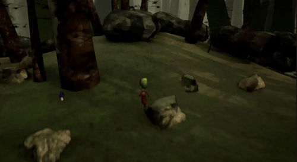
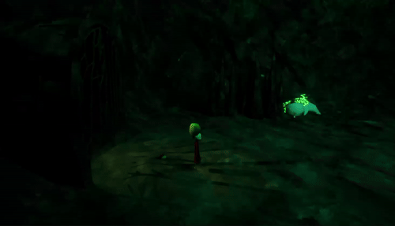
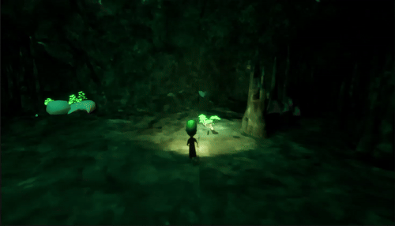
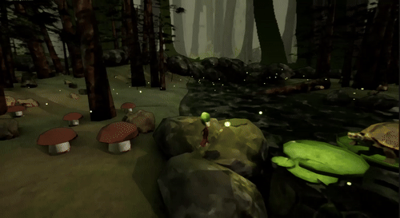
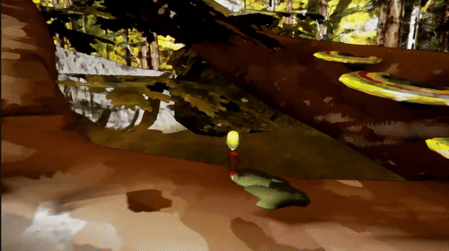

# Little Moth – Unreal Engine

## Most Important Files

### Pickup & Equip Items
 

*Lets the player collect items like mushrooms.*

 

*Lets the player equip a specific item, like a lamp.*

### Companion
 
  
*A little companion that follows the player once they reach it.*

### Quest
 
  
*Give the turtle enough dragonflies to clear the path and continue.*

### Respawn
 
  
*Creates a checkpoint on overlap, where the player will respawn if they fall.*

### Double Jump
 
  
*Lets the player jump higher to climb the tree.*
