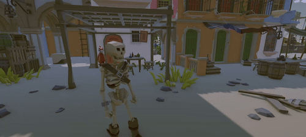

# Pirate Game – Unity

## Most Important Files

### Finite-State-Machine
Character/StateMachines/PlayerStates Folder: LocomotionState, JumpState, UnderwaterLoco  
  
*Handles all the movement logic of the player.*

### Inventory System
Inventory Folder: InventoryManager, InventoryItem  
  
*Keeps track of all items in the inventory, like collectibles and coins. The player can drop, equip, and use them.*

### ScriptableObjects
ScriptableObjects/Items/Scripts Folder: ItemData, CoinData  
*System to create as many different collectible items as needed. Works together with the inventory system.*

### Ship System
Ship Folder: ShipController, ShipMovement  
  
*Lets the player control a ship, dock, and undock at specific points.*