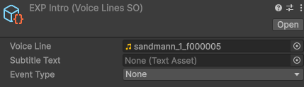
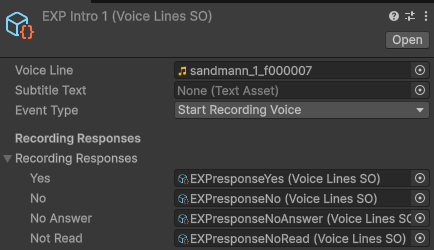
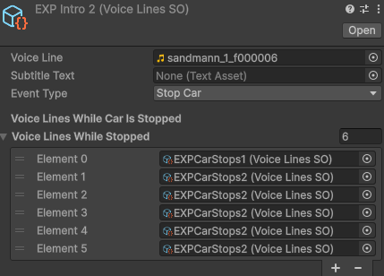

# Taxi Driver – Unity VR

## Most Important Files

### Taxi Driver Voice Manager
_OurAssets/_Scripts Folder: **LuigiVoiceManager**  
*Handles the full dialogue system for the taxi driver, Luigi. Works together with the ScriptableObjects.*

### VoiceLine and Chapter ScriptableObjects
_OurAssets/_Scripts/SOScripts Folder: **ChapterSO, VoiceLineSO**

*System that lets the team create voicelines for the taxi driver, with an assigned audio file, subtitle text, and an event (None, Stop Car, Start Voice Recording).  
Voicelines can be bundled into chapters, which can be triggered by picking up an object if needed.*

**Events:**
- **None:** Nothing happens after the audio plays.  
- **Stop Car:** The taxi stops after the audio plays. Additional voicelines can be played here.  
- **Start Voice Recording:** Starts recording the player’s voice after the audio plays. Up to five response options can be added depending on what the player says.

